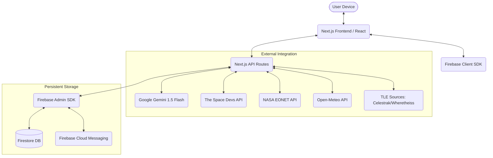
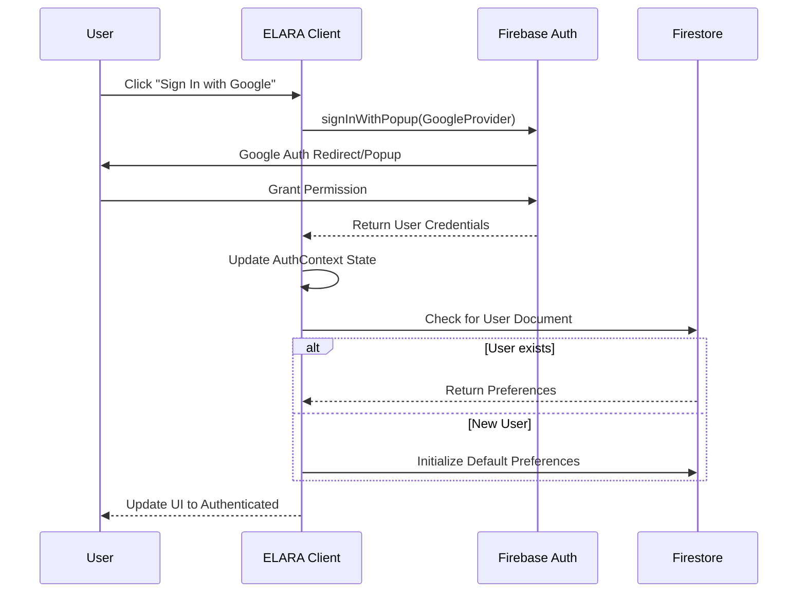
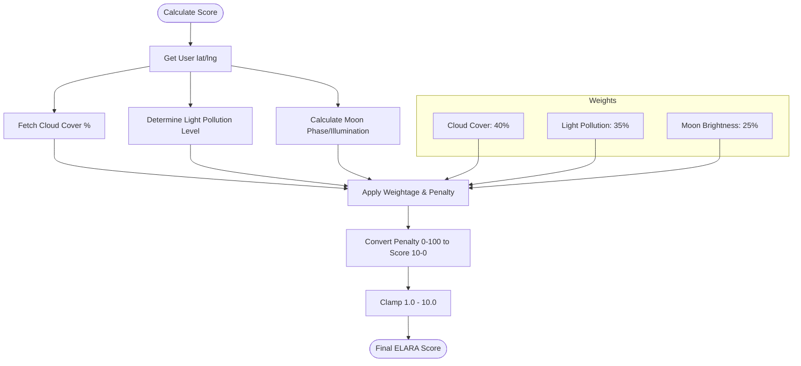
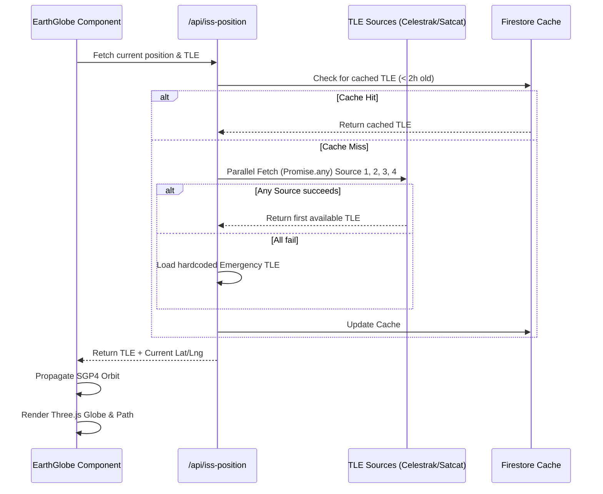
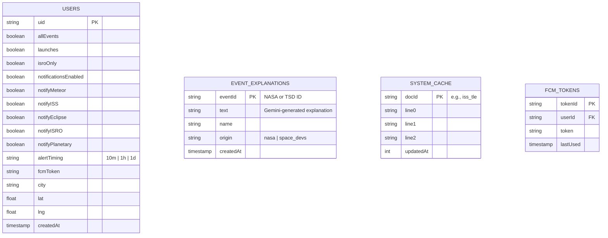

# 🌌 ELARA: The Ultimate Sky Event Companion - Master Documentation

This is the comprehensive technical documentation for **ELARA**, a real-time Progressive Web Application (PWA) designed for celestial observation, satellite tracking, and space launch awareness, specifically optimized for the Indian night sky.

## Quick Reference

| Item | Value |
|---|---|
| Live URL | https://elara-livid.vercel.app |
| GitHub | github.com/vishnu190806/ELARA |
| Framework | Next.js 14.2.14 |
| Node version | 18+ |
| Install command | npm install --legacy-peer-deps |
| Dev command | npm run dev |
| Build command | npm run build |
| Deploy command | npx vercel --prod |
| Firebase project | elara |
| Firebase region | asia-south1 (Mumbai) |
| Vercel plan | Hobby |

---

## 🏗️ 1. Overall System Architecture

ELARA is built using a modern full-stack serverless architecture with **Next.js 14** at its core. It leverages AI for content enrichment and Firebase for real-time data persistence and notifications.



---

## 🔐 2. Authentication Flow

ELARA uses Google OAuth via Firebase Authentication. User profiles are synchronized with Firestore to maintain preferences across devices.



---

## 📊 3. Sky Score Calculation Flow

The **Sky Score** is a proprietary metric (1.0 - 10.0) that indicates the quality of the night sky for observation.



---

## 🛰️ 4. ISS Tracking Data Flow

ELARA tracks the ISS in real-time, fetching Two-Line Element sets (TLE) and propagating orbits on a 3D Earth Globe.



---

## 🔔 5. Notification Flow

Push notifications are delivered via Firebase Cloud Messaging (FCM).

```mermaid
graph LR
    User[User Opt-in] --> Permission[Request Browser Permission]
    Permission --> Token[Generate FCM Token]
    Token --> API[/api/notifications/subscribe]
    API --> Firestore[(Store Token + Prefs)]
    
    subgraph "Server Cron"
        Cron[Cron Job: Rare Event Discovery]
        Cron --> Filter[Filter Users by Region/Prefs]
        Filter --> FCM[Send via Firebase Cloud Messaging]
    end
    
    FCM --> UserDevice[Device Push Notification]
```

---

## 🗄️ 6. Firestore Collection Structure



---

## 📂 7. File-by-File Analysis

### 📡 Core Logic (`src/lib`)

- **`skyScore.ts`**: The mathematical core for visibility. Implements the 40/35/25 weighting system.
- **`tleFetcher.ts`**: A robust fallback-oriented orbital data engine with a Firestore caching layer.
- **`explanationService.ts`**: The AI adapter. It routes raw event titles to Google Gemini 1.5 Flash and caches the 2-sentence summaries.
- **`astronomy.ts`**: Astronomical utility functions (Julian Date conversions, Moon phase calculations).
- **`weather.ts`**: Integration with Open-Meteo for real-time cloud cover data.

### 🌐 UI Components (`src/components`)

- **`EarthGlobe.tsx`**: A Three.js based 3D earth. Uses custom shaders for a "bloom" atmosphere effect and renders orbital paths.
- **`SkyMap.tsx`**: A high-performance 2D Canvas component that renders a map of the local sky based on Zenith projection.
- **`SkyScoreRing.tsx`**: A Framer Motion powered tactical HUD element that visualizes the current Sky Score.
- **`ISSTracker.tsx`**: A "Mission Control" style dashboard displaying real-time velocity, altitude, and position.
- **`StarField.tsx`**: An immersive Three.js background with twinkling stars and animated shooting stars.

---

## 🚀 8. Feature Deep-Dive

### **🔭 Stellar Scope (Sky Map)**
The Stellar Scope is not an image; it's a dynamic coordinate transformation engine. It converts Right Ascension (RA) and Declination (Dec) of stars into local X/Y coordinates on a circular canvas based on the user's Local Siderial Time (LST).

### **🌠 AI-Enhanced Events**
Events from external sources often have technical or dry descriptions. ELARA uses a server-side service to pipe these descriptions through Gemini:
> *Prompt: "Write a simple, 2-sentence explanation for the general public about this space event: [Event Name]."*

### **📦 PWA First Design**
ELARA is built to feel like a native app.
- **Offline Mode**: Key assets are cached.
- **Install Prompt**: Custom UI (`PWAInstallPrompt.tsx`) guides users to "Add to Home Screen".
- **Shortcuts**: Manifest-defined links for "Upcoming Events" and "ISRO Missions".

---

## 🛠️ 9. Technical Stack & Dependencies

- **Core**: Next.js 14 (App Router / Server Actions)
- **Authentication**: Firebase Auth (Google Provider)
- **Database**: Cloud Firestore
- **AI**: Google Generative AI (Gemini 1.5 Flash)
- **3D Graphics**: Three.js / React Three Fiber
- **Animations**: Framer Motion
- **Icons**: Lucide React
- **CSS**: Tailwind CSS

---

## ⚙️ 10. Setup & Installation

### **1. Clone & Install**
```bash
git clone https://github.com/vishnu190806/ELARA.git
cd ELARA
npm install --legacy-peer-deps
```

> [!CAUTION]
> ⚠️ WARNING: Running plain `npm install` WILL FAIL on this project due to peer dependency conflicts between `react-globe.gl` and Next.js 14. Always use `--legacy-peer-deps` flag.

### **2. Environment Configuration**
Create a `.env.local` file with the following variables:

| Variable | Purpose | Source | Public? |
|---|---|---|---|
| NEXT_PUBLIC_NASA_API_KEY | NASA APOD + EONET APIs | api.nasa.gov | Yes |
| NEXT_PUBLIC_FIREBASE_API_KEY | Firebase client init | Firebase Console → Project Settings | Yes |
| NEXT_PUBLIC_FIREBASE_AUTH_DOMAIN | Firebase auth domain | Firebase Console | Yes |
| NEXT_PUBLIC_FIREBASE_PROJECT_ID | Firebase project ID | Firebase Console | Yes |
| NEXT_PUBLIC_FIREBASE_STORAGE_BUCKET | Firebase storage | Firebase Console | Yes |
| NEXT_PUBLIC_FIREBASE_MESSAGING_SENDER_ID | FCM sender ID | Firebase Console → Cloud Messaging | Yes |
| NEXT_PUBLIC_FIREBASE_APP_ID | Firebase app ID | Firebase Console → Your Apps | Yes |
| NEXT_PUBLIC_FIREBASE_VAPID_KEY | Web push certificates | Firebase Console → Cloud Messaging → Web Push | Yes |
| NEXT_PUBLIC_APP_URL | Production URL | https://elara-livid.vercel.app | Yes |
| GEMINI_API_KEY | Gemini AI explanations | aistudio.google.com | NO - server only |
| FIREBASE_ADMIN_PROJECT_ID | Admin SDK | Firebase Service Account JSON | NO - server only |
| FIREBASE_ADMIN_CLIENT_EMAIL | Admin SDK | Firebase Service Account JSON | NO - server only |
| FIREBASE_ADMIN_PRIVATE_KEY | Admin SDK | Firebase Service Account JSON | NO - server only |

### **3. Verify Build & Run**
Before deploying, it is recommended to verify the production build locally:
```bash
npm run build
```

Then run the production server:
```bash
npm start
```

For development with hot-reloading:
```bash
npm run dev
```

---

## 📜 11. Maintenance & Troubleshooting

- **TLE Sources**: If all TLE sources fail, the system uses an emergency fallback TLE hardcoded in `tleFetcher.ts`.
- **429 Errors**: Gemini free tier is limited. The `explanationService` implements sequential processing and small delays to stay under the RPM limit.
- **ISS Position Latency**: The system fetches from multiple mirrors to ensure the ISS dot stays moving even if one coordinate source lags.

---

## 12. Known Issues & Workarounds

### satellite.js WASM Warnings
- **Issue**: Console shows "topLevelAwait" and circular dependency warnings.
- **Cause**: `satellite.js` imports WASM build incompatible with Next.js 14 webpack.
- **Status**: Non-breaking — app works correctly.
- **Workaround**: Added to `serverComponentsExternalPackages` in `next.config.js`.

### TLE Sources Timeout in Local Dev
- **Issue**: All TLE sources fail locally with `TimeoutError`.
- **Cause**: Local network or firewall blocks outbound requests to satellite data sources.
- **Status**: Expected — falls back to hardcoded TLE.
- **Note**: Works perfectly on Vercel production.

### PWA Disabled in Development
- **Issue**: "PWA support is disabled" in dev console.
- **Cause**: `next-pwa` intentionally disables service worker in development mode.
- **Status**: Expected behavior, not a bug.
- **Production**: PWA fully functional.

### Vercel Hobby Cron Limitation
- **Issue**: Cron jobs limited to once per day.
- **Cause**: Vercel Hobby plan restriction.
- **Workaround**: TLE refreshes at midnight, event checks at noon UTC. Upgrade to Pro for more frequent crons.

### Google OAuth on New Domains
- **Issue**: Google Sign-In fails on new deployment URLs.
- **Cause**: Domain not whitelisted in Google Cloud Console.
- **Fix**: Add domain to:
    1. Firebase Console → Authentication → Authorized Domains.
    2. Google Cloud Console → APIs & Services → Credentials → OAuth 2.0 Client → Authorized JavaScript Origins + Authorized Redirect URIs (add: `https://yourdomain.com/__/auth/handler`).

---

## 13. Vercel Deployment

### vercel.json configuration:
```json
{
  "installCommand": "npm install --legacy-peer-deps",
  "crons": [
    {
      "path": "/api/cron/refresh-tle",
      "schedule": "0 0 * * *"
    },
    {
      "path": "/api/cron/check-events",
      "schedule": "0 12 * * *"
    }
  ]
}
```

### Deploy command:
```bash
npx vercel --prod
```

### After first deploy:
1. Go to **Vercel → Settings → Environment Variables**.
2. Add **ALL** variables from `.env.local`.
3. Add `NEXT_PUBLIC_APP_URL` = your Vercel URL.
4. Redeploy after adding variables.
5. Add Vercel URL to **Firebase authorized domains**.
6. Add Vercel URL to **Google Cloud OAuth origins**.

### First-time Firestore setup:
Visit: `https://your-url.vercel.app/api/seed`
This seeds the `light_pollution_zones` collection. **Required before Sky Score will work correctly.**

---
*Created by Vishnu - ELARA v1.0.0 Documentation*
